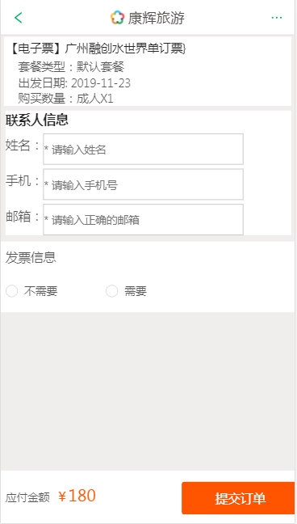

### 康辉旅游
---

* 官网：https://m.cct.cn/
* 上线网址：http://119.23.107.32
* 后台网址：http://119.23.107.32：8080
* git仓库地址：https://github.com/gzh51907/khly.git

### 团队与分工
---

* 组长：秦慧云，成员：郑伯桂、陈东涛、汪云飞

* 负责模块说明
    * 秦慧云：
        1、首页：
            ant-design框架结合axios请求实现轮播图、选项卡、回到顶部、联系我们等功能；
            利用react-router实现点击不同位置跳转到搜索页面、详情页、分类页、客服页、登录和我的页面；
            根据是否登录，判断点击小图标，若未登录则进入登录页，已登录进入我的页面，并且出现小红点；
        2、搜索页：
            利用react动态路由和axios请求和联系数据库实现搜索和渲染不同商品信息
            如果搜索不到商品则提示用户换个关键词
        3、我的：
            判断localStorage是否存在username，未登录则无法进入，登录后点击退出可回到首页
            头像部分利用类名实现滑入旋转放大的特效
        4、机器人客服：
            获取图灵机器人Api接口，利用服务器代理，实现与机器人对话
        5、后台商品的编辑和删除功能：
            ant-design框架实现点击编辑按钮右侧出现可修改表格，修改数据后保存，请求数据库再次更新商品；
            点击删除按钮可删除对应数据库商品，当修改或删除成功可成功提示弹窗

    * 郑伯桂：
        1、列表页：
            使用Ant-Design框架的Menu导航菜单实现列表页的导航栏切换；
            商品信息数据的接口，根据商品的标签进行筛选并且渲染商品；
            使用Ant-Design框架 的Drawer抽屉 ，以及价格之间的升降序；
            利用react-router实现点击不同位置跳转到搜索页面、详情页、首页；
        2、后台管理系统：
            使用Ant-Design框架的 Table表格进行商品信息的渲染；
            以及商品信息的添加，增加商品信息表单为空的验证，以及添加成功之后的信息提示；

    * 陈东涛：
        1.前端注册：
            利用axios、node、以及正则实现注册功能。
            利用react-router实现点击后退上一页。
            利用axios发起请求，校验用户是否存在，注册时密码强度是否符合正则规则，注册规则符合后，把用户信息存进monggo数据库
        2.前端登录：
            利用axios、node、实现注册功能。
            利用axios请求，校验用户登录的信息是否符合数据库，存在则登录成功
        3.后台登录以及退出功能：
            ant-design框架结合利用axios、node、实现注册功能。
            利用axios请求，校验用户登录的信息是否符合数据库，存在则登录成功，存token，退出则清除token
        4.后台布局
            利用ant-design框架结合react-router实现功能点击切换内容。
        4.后台添加用户：
            ant-design框架结合axios、node、实现注册功能。
            利用axios请求，校验用户登录的信息是否符合数据库，存在则登录成功
        5.后台用户信息管理
            ant-design框架结合axios、node、实现用户信息分页、注销功能。

    * 汪云飞：
        1、详情页 ：
            ant-design框架，生命周期函数，async...await等实现了页面的布局、数据渲染、回到顶部功能
            利用redux-router实现点击跳转相应页面
        2、订单页：
            ant-design框架，get请求等实现的页面布局和数据渲染
            点击根据路由跳转，返回上一页

### 项目图
---

* 首页
 

* 分类
 

* 详情页
 

* 我的
 

* 注册
 

* 登录
 

* 机器人
 

* 搜索
 

* 立即预定
 

* 提交订单
 

## 技术栈

### 前端
* React
* React-Router
* Webpack
* axios
* antd
* git

### 后端
* Nodejs
* Express
* MongoDB
* antd

### 项目目录
---
------（前端目录
|-- undefined
|.babelrc
│  .gitignore
│  package-lock.json
│  package.json
│  webpack.config.js
|
    |─src（项目目录）
    │  App.jsx
    │  App.scss
    │  main.js
    │  template.html
    │  
    ├─Api
    │      index.js
    │      
    │      
    ├─images(图片)
    │  │  header_logo.png
    │  │  xiangqing11.png
    │  │  
    │  └─shouye
    │      ├─chujingtuijian
    │      │      11.jpg
    │      │      12.jpg
    │      │      13.jpg
    │      │      14.jpg
    │      │      15.jpg
    │      │      16.jpg
    │      │      17.jpg
    │      │      18.jpg
    │      │      19.jpg
    │      │      20.jpg
    │      │      5.jpg
    │      │      6.jpg
    │      │      7.jpg
    │      │      8.jpg
    │      │      9.jpg
    │      │      chujing-tuijian1.jpg
    │      │      chujing-tuijian2.jpg
    │      │      chujing-tuijian3.jpg
    │      │      chujing-tuijian4.jpg
    │      │      
    │      ├─dingzhiyou
    │      │      kanghuidingzhi.png
    │      │      kehudingzhi.png
    │      │      
    │      ├─fenlei
    │      │      chujing.png
    │      │      dandiyou.png
    │      │      guonei.png
    │      │      qianzheng.png
    │      │      zhoubian.png
    │      │      
    │      ├─lunbo
    │      │      lunbo1.jpg
    │      │      lunbo2.jpg
    │      │      lunbo3.jpg
    │      │      lunbo4.jpg
    │      │      lunbo5.jpg
    │      │      lunbo6.jpg
    │      │      
    │      ├─mudidi
    │      │      balidao.jpg
    │      │      beijing.jpg
    │      │      haerbin.png
    │      │      pujidao.jpg
    │      │      riben.jpg
    │      │      yunnan.jpg
    │      │      
    │      └─tubiao
    │              apple-touch-icon.png
    │              
    ├─pages(项目页面)
    │      Form.jsx
    │      Goods.jsx
    │      Home.jsx
    │      List.jsx
    │      Login.jsx
    │      Mine.jsx
    │      Order.jsx
    │      Reg.jsx
    │      Robit.jsx
    │      SearchGoods.jsx
    │      
    │      
    ├─sass（项目样式）
    │      base.css
    │      Form.scss
    │      Goods.css
    │      Goods.min.css
    │      Goods.scss
    │      home.scss
    │      List.scss
    │      Login.scss
    │      Mine.scss
    │      Order.scss
    │      Reg.scss
    │      Robit.scss
    │      searchGoods.scss
    
    |------（后台目录）
    │  .babelrc
    │  .gitignore
    │  11.txt
    │  package-lock.json
    │  package.json
    │  webpack.config.js   

    src
        │  App.jsx
        │  App.scss
        │  main.js
        │  template.html
        │  
        ├─Api
        │      index.js
        │      
        │      
        ├─images(图片)
        │      header_logo.png
        │      
        ├─pages（后台页面）
        │      AddGoods.jsx
        │      AddUser.jsx
        │      Admin.jsx
        │      goods.jsx
        │      User.jsx
        │      
        ├─saga
        │      index.js
        │      
        ├─sass（页面样式）
        │      AddGoods.scss
        │      AddUser.scss
        │      base.css
        │      goods.scss
        │      
                
